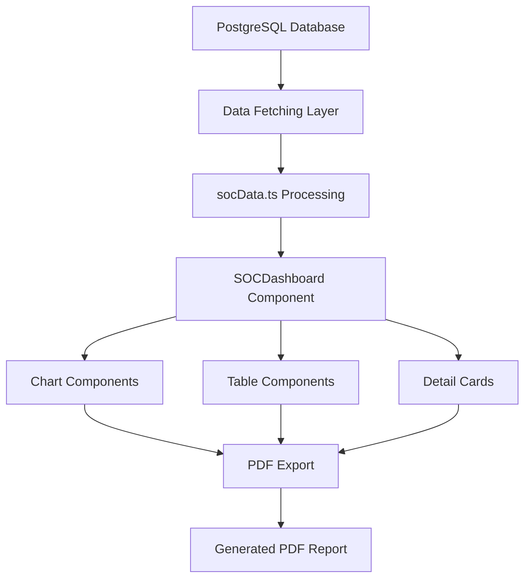

# Dashboard SOC - Sistema de Informes Trimestrales

## 📋 Resumen del Proyecto

Este sistema genera informes trimestrales SOC (Security Operations Center) con visualizaciones avanzadas, métricas de rendimiento y exportación a PDF. Replicas la funcionalidad de sistemas Flask tradicionales con tecnología moderna React.

## 🏗️ Arquitectura del Proyecto

```
src/
├── components/
│   ├── ui/                    # Componentes base shadcn/ui
│   └── soc/                   # Módulos específicos del SOC
├── data/                      # Datos simulados y lógica de negocio
├── types/                     # Definiciones TypeScript
├── utils/                     # Utilidades (exportación PDF)
└── pages/                     # Páginas principales
```

## 🧩 Módulos Principales

### 📊 **Módulo de Visualización de Datos (`src/components/soc/`)**

#### `SOCDashboard.tsx` - **Dashboard Principal**
- **Función**: Contenedor principal que orquesta todos los componentes
- **Dependencias**: Todos los componentes de gráficos, tablas y secciones
- **Props**: `cliente`, `periodo`, `autores`
- **Estado**: Maneja `reportData` y controla el modo de impresión

#### `KPICard.tsx` - **Tarjetas de Métricas**
- **Función**: Muestra métricas clave (incidentes totales, MTTA, MTTR, activos afectados)
- **Dependencias**: `Card` component de shadcn/ui
- **Props**: `title`, `value`, `subtitle`, `icon`

#### `SeverityChart.tsx` - **Gráfico de Severidad (Donut)**
- **Función**: Visualiza distribución de incidentes por severidad
- **Dependencias**: `recharts` (PieChart, Cell)
- **Props**: `data` con formato `[{name, value, color}]`
- **Colores**: Usa variables CSS `--critical`, `--high`, `--medium`, etc.

#### `DailyIncidentsChart.tsx` - **Gráfico de Incidentes Diarios**
- **Función**: Muestra evolución temporal de incidentes (últimos 14 días)
- **Dependencias**: `recharts` (AreaChart, ResponsiveContainer)
- **Props**: `data` con formato `[{date, Critical, High, Medium, Low}]`

#### `TopCVEChart.tsx` - **Top CVE (Barras Horizontales)**
- **Función**: Muestra las 10 CVE más frecuentes
- **Dependencias**: `recharts` (BarChart)
- **Props**: `data` con formato `[{name: "CVE-XXXX", value: number}]`

#### `TopAssetsChart.tsx` - **Activos Más Afectados**
- **Función**: Ranking de activos con más incidentes
- **Dependencias**: `recharts` (BarChart)
- **Props**: `data` con formato `[{name: "servidor", value: number}]`

#### `StatusChart.tsx` - **Estado de Incidentes (Donut)**
- **Función**: Distribución por estado (Abierta, En revisión, Mitigada)
- **Dependencias**: `recharts` (PieChart)
- **Props**: `data` con formato de estado

#### `MitreRadarChart.tsx` - **Radar MITRE ATT&CK**
- **Función**: Mapa de tácticas MITRE más utilizadas
- **Dependencias**: `recharts` (RadarChart)
- **Props**: `data` con tácticas MITRE transformadas

### 📋 **Módulo de Tablas y Detalles**

#### `IncidentsTable.tsx` - **Tabla de Incidentes**
- **Función**: Muestra últimos 15 incidentes con detalles
- **Dependencias**: `Table` components de shadcn/ui
- **Props**: `incidents` array con campos: `created_ts`, `severity`, `asset`, `cve`, `status`, `tactic`
- **Características**: Badges de severidad, clasificación automática de tipo de incidente

#### `CVEDetailsCard.tsx` - **Tarjetas de Detalles CVE**
- **Función**: Información expandida sobre CVE críticas
- **Dependencias**: `Card`, `Badge` de shadcn/ui
- **Props**: `cveData` con título, descripción, mitigaciones, score
- **Base de Datos**: Utiliza `CVE_DATABASE` local para enriquecimiento

### 📄 **Módulos de Contenido**

#### `RecommendationsSection.tsx` - **Sección de Recomendaciones**
- **Función**: Lista de acciones recomendadas basadas en análisis
- **Dependencias**: `Card` components
- **Props**: `recommendations` con `icon`, `titulo`, `detalle`, `owner`, `deadline`
- **Lógica**: Genera recomendaciones dinámicas basadas en top CVE

#### `HighlightedEventsSection.tsx` - **Eventos Destacados**
- **Función**: Timeline de eventos importantes del período
- **Props**: `events` con `titulo`, `fecha`, `resumen`

#### `GlossarySection.tsx` - **Glosario Técnico**
- **Función**: Definiciones de términos SOC/ciberseguridad
- **Props**: `glossaryItems` con `term` y `def`

### 🎛️ **Módulos de Control**

#### `ReportHeader.tsx` - **Cabecera del Informe**
- **Función**: Información de cliente, período y autores
- **Props**: `cliente`, `periodo`, `autores`
- **Diseño**: Layout responsive con logo/branding

#### `ReportActions.tsx` - **Botones de Acción**
- **Función**: Exportar PDF, imprimir, opciones de visualización
- **Dependencias**: `Button` de shadcn/ui, `utils/pdfExport`
- **Características**: Toast notifications, manejo de errores

## 🗄️ **Sistema de Datos**

### `src/data/socData.ts` - **Fuente de Datos**

#### Funciones Principales:
- `generateReportData()`: Genera dataset completo simulado
- `generateIncidents()`: Crea incidentes con distribución realista
- `generateDailyData()`: Datos temporales últimos 14 días
- `classifyIncident()`: Heurística para clasificar tipos de incidente

#### CVE Database Local:
```typescript
const CVE_DATABASE = {
  "CVE-2024-12345": {
    titulo: "RCE en servicio web",
    descripcion: "Ejecución remota de código...",
    mitigacion: ["Parche", "WAF", "Validación"],
    score: 9.8
  }
  // ... más CVE
}
```

## 🔧 **Sistema de Utilidades**

### `src/utils/pdfExport.ts` - **Exportación PDF**

#### Características Técnicas:
- **Motor**: html2canvas + jsPDF
- **Formato**: A4 (210x297mm)
- **Márgenes**: 8mm (optimizado para contenido amplio)
- **Resolución**: 1.5x scale para calidad alta
- **Paginación**: Automática sin cortes en elementos

#### Proceso de Exportación:
1. Aplica clase `print-mode` para estilos específicos
2. Captura canvas con html2canvas
3. Calcula dimensiones para ajuste óptimo
4. Genera PDF multipágina sin márgenes entre páginas
5. Mantiene márgenes externos consistentes

## 🎨 **Sistema de Diseño**

### Variables CSS Principales (`src/index.css`):
```css
:root {
  /* Severidad de incidentes */
  --critical: 0 84% 60%;      /* Rojo crítico */
  --high: 25 95% 53%;         /* Naranja alto */
  --medium: 45 93% 47%;       /* Amarillo medio */
  --low: 142 76% 36%;         /* Verde bajo */
  --info: 220 9% 46%;         /* Gris informacional */
  
  /* Estados */
  --open: 0 84% 60%;          /* Abierto (rojo) */
  --review: 45 93% 47%;       /* En revisión (amarillo) */
  --mitigated: 142 76% 36%;   /* Mitigado (verde) */
}
```

### Estilos PDF Específicos:
```css
@media print {
  .print-mode { /* Optimizaciones para PDF */ }
  .page-break { page-break-before: always; }
  .avoid-break { break-inside: avoid; }
}
```

## 🔗 **Dependencias del Proyecto**

### Core Framework:
- **React 18.3.1**: Framework principal
- **TypeScript**: Tipado estático
- **Vite**: Build tool y dev server

### UI/Componentes:
- **shadcn/ui**: Sistema de componentes base
- **Tailwind CSS**: Framework de utilidades CSS
- **Lucide React**: Iconografía

### Visualización:
- **Recharts 2.15.4**: Biblioteca de gráficos React
- **Responsive Container**: Gráficos adaptativos

### PDF/Export:
- **html2canvas 1.4.1**: Captura de DOM a canvas
- **jsPDF 3.0.3**: Generación de PDF client-side

### Desarrollo:
- **@types/html2canvas**: Tipos TypeScript para html2canvas

## 📡 **Rutas y Endpoints**

### Rutas Frontend:
- `/` - Dashboard principal SOC
- `/not-found` - Página 404

### Futuras Integraciones Backend:
```typescript
// Estructura para API REST
GET /api/soc/report?periodo=Q1-2024&cliente=ACME
POST /api/soc/incidents
GET /api/soc/cve/{cveId}
GET /api/soc/assets/top
```

## 🗃️ **Esquemas de Base de Datos PostgreSQL**

### Tabla Principal: `incidents`
```sql
CREATE TABLE incidents (
  id SERIAL PRIMARY KEY,
  created_at TIMESTAMP DEFAULT NOW(),
  date DATE,
  severity VARCHAR(20) NOT NULL,          -- 'Critical'|'High'|'Medium'|'Low'|'Informational'
  asset VARCHAR(255) NOT NULL,            -- 'SRV-ERP-01', 'WS-CEO', etc.
  cve VARCHAR(50),                        -- 'CVE-2024-12345'
  status VARCHAR(50) NOT NULL,            -- 'Abierta'|'En revisión'|'Mitigada'
  tactic VARCHAR(50),                     -- MITRE: 'TA0001', 'TA0003', etc.
  incident_type VARCHAR(100),             -- 'Malware'|'Phishing'|'Vulnerabilidad'
  source_ip INET,                         -- IP origen (opcional)
  destination_ip INET,                    -- IP destino (opcional)
  description TEXT,                       -- Descripción detallada
  analyst VARCHAR(100),                   -- Analista asignado
  updated_at TIMESTAMP DEFAULT NOW()
);

-- Índices para optimización de consultas
CREATE INDEX idx_incidents_severity ON incidents(severity);
CREATE INDEX idx_incidents_date ON incidents(date);
CREATE INDEX idx_incidents_asset ON incidents(asset);
CREATE INDEX idx_incidents_cve ON incidents(cve);
CREATE INDEX idx_incidents_status ON incidents(status);
CREATE INDEX idx_incidents_tactic ON incidents(tactic);
CREATE INDEX idx_incidents_created_at ON incidents(created_at);
```

### Tabla de Activos: `assets`
```sql
CREATE TABLE assets (
  id SERIAL PRIMARY KEY,
  name VARCHAR(255) UNIQUE NOT NULL,      -- 'SRV-ERP-01'
  type VARCHAR(100),                      -- 'Server'|'Workstation'|'Firewall'
  ip_address INET,
  location VARCHAR(255),                  -- 'DataCenter-A'
  criticality VARCHAR(20),                -- 'Critical'|'High'|'Medium'|'Low'
  owner VARCHAR(255),                     -- Responsable
  operating_system VARCHAR(255),
  created_at TIMESTAMP DEFAULT NOW(),
  updated_at TIMESTAMP DEFAULT NOW()
);
```

### Tabla CVE: `cve_database`
```sql
CREATE TABLE cve_database (
  cve_id VARCHAR(50) PRIMARY KEY,         -- 'CVE-2024-12345'
  title VARCHAR(500),
  description TEXT,
  cvss_score DECIMAL(3,1),               -- 9.8
  severity VARCHAR(20),                   -- Calculada del CVSS
  published_date DATE,
  mitigation_steps TEXT[],                -- Array de pasos
  affected_products TEXT[],               -- Productos afectados
  references TEXT[],                      -- URLs de referencia
  created_at TIMESTAMP DEFAULT NOW()
);
```

### Vistas para Reportes:
```sql
-- Vista agregada para dashboard
CREATE VIEW dashboard_summary AS
SELECT 
  DATE_TRUNC('day', created_at) as incident_date,
  severity,
  COUNT(*) as incident_count,
  COUNT(DISTINCT asset) as unique_assets
FROM incidents 
WHERE created_at >= CURRENT_DATE - INTERVAL '30 days'
GROUP BY DATE_TRUNC('day', created_at), severity
ORDER BY incident_date DESC;

-- Vista de top CVE
CREATE VIEW top_cve_summary AS
SELECT 
  cve,
  COUNT(*) as occurrence_count,
  MAX(cvss_score) as max_severity,
  COUNT(DISTINCT asset) as affected_assets
FROM incidents i
LEFT JOIN cve_database c ON i.cve = c.cve_id
WHERE i.created_at >= CURRENT_DATE - INTERVAL '90 days'
  AND i.cve IS NOT NULL
GROUP BY cve
ORDER BY occurrence_count DESC
LIMIT 10;
```

## 🚀 **Despliegue y Configuración**

### Variables de Entorno:
```bash
# Backend connection (futuro)
REACT_APP_API_URL=https://api.soc.empresa.com
REACT_APP_POSTGRES_HOST=localhost
REACT_APP_POSTGRES_PORT=5432
REACT_APP_POSTGRES_DB=soc_reports

# Configuración de reportes
REACT_APP_DEFAULT_CLIENT=ACME Corp
REACT_APP_REPORT_RETENTION_DAYS=365
```

### Build y Deploy:
```bash
# Desarrollo
npm run dev

# Producción
npm run build
npm run preview

# Deploy con Docker
docker build -t soc-dashboard .
docker run -p 3000:3000 soc-dashboard
```

## 🔄 **Flujo de Datos**



## 📈 **Métricas y KPIs**

### KPIs Calculados:
- **Incidentes Totales**: COUNT(*) último período
- **Activos Afectados**: COUNT(DISTINCT asset)
- **MTTA** (Mean Time to Acknowledge): Tiempo promedio hasta asignación
- **MTTR** (Mean Time to Resolution): Tiempo promedio hasta resolución

### Gráficos Generados:
1. **Severidad**: Distribución porcentual
2. **Tendencia Temporal**: Últimos 14 días por severidad
3. **Top CVE**: 10 más frecuentes
4. **Activos**: Top 8 más afectados
5. **Estados**: Distribución actual
6. **MITRE**: Radar de tácticas utilizadas

---

**Versión**: 1.0  
**Tecnologías**: React 18 + TypeScript + Tailwind + Recharts  
**Base de Datos**: PostgreSQL 16+  
**Compatibilidad**: Navegadores modernos, Node.js 18+